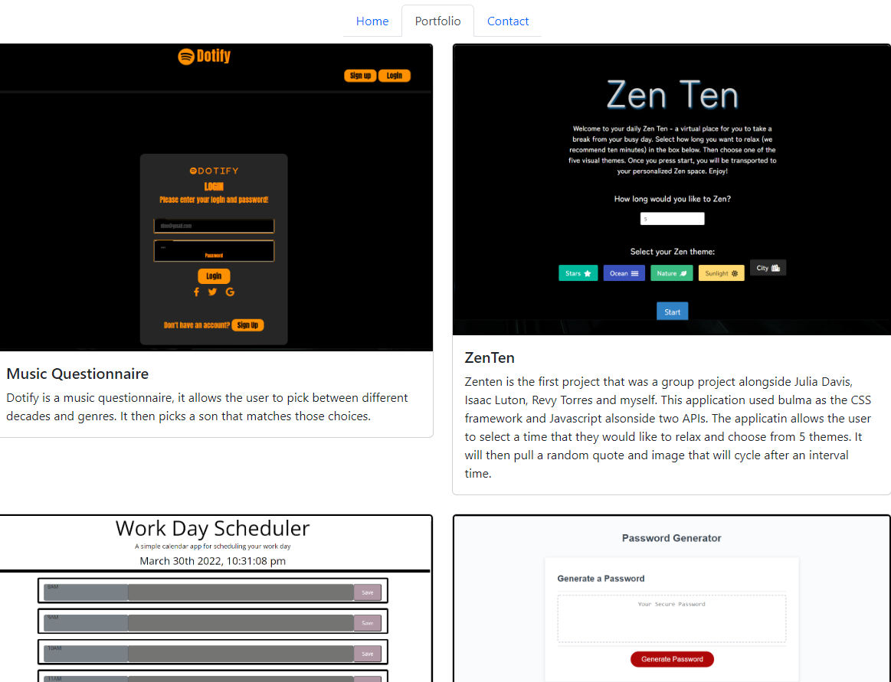

## React Portfolio
  
  
 
  ## Table of Contents
  - [Description](#description)
  - [Installation](#nstallation)
  - [Contributors](#contributors)
  - [Usage](#usage)
  - [Tests](#tests)
  - [Questions](#questions)

  ## Description
  This is my portfolio that showcases the skills and projects that I have learned in the past 6 months during my time at UW Coding Bootcamp. It is the first project that implements React JS to complete the build and deploy to GitHub pages. 

  ## Installation
  npm i for all dependcies 

  ## Contributors
  Email me if you would like to contribute

  ## Usage
  To showcase to possible employes the skills I have gained and the body or work I am capable of doing. 

  ## Tests
  None 

  ## Questions
  - GitHub: RafaelH731
  - Email: rafaelherrera731@gmail.com
  - https://rafaelh731.github.io/react-portfolio/
  
  ## Screenshots
  - 
  

